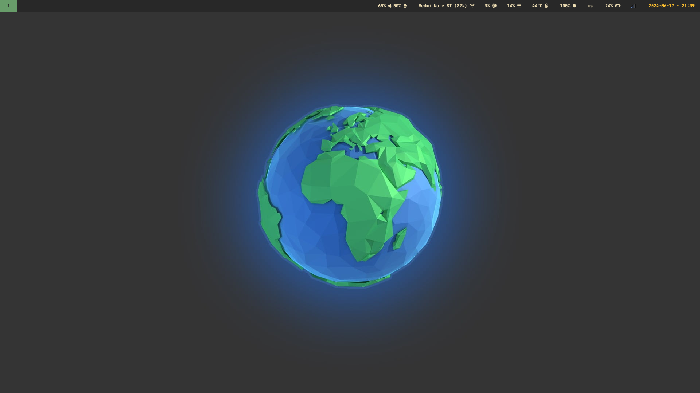
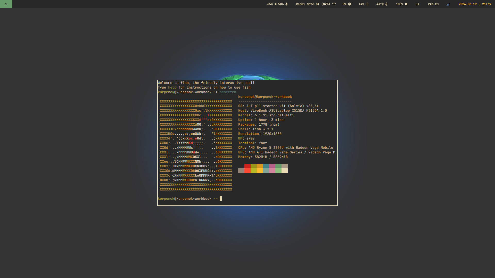
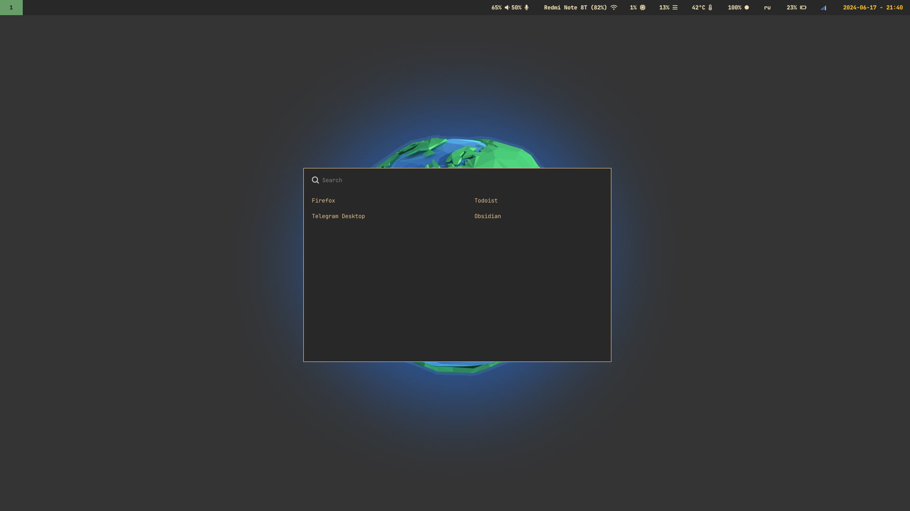
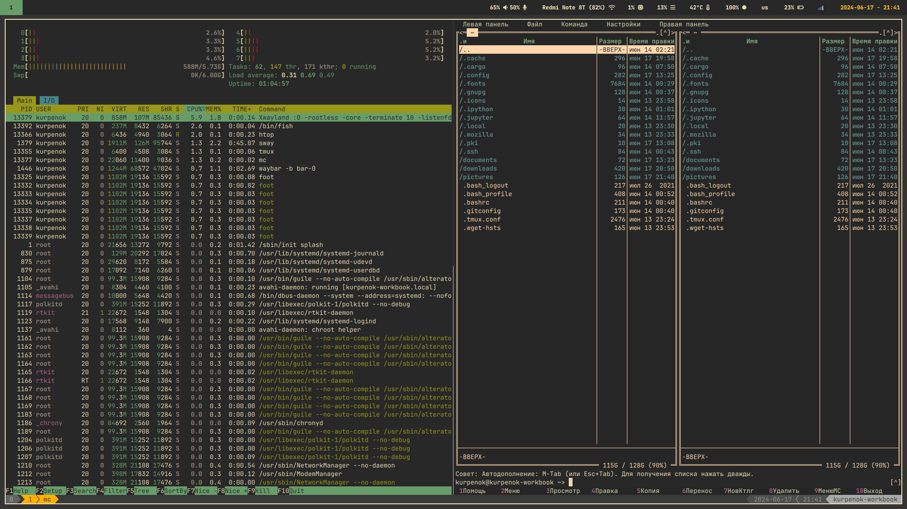
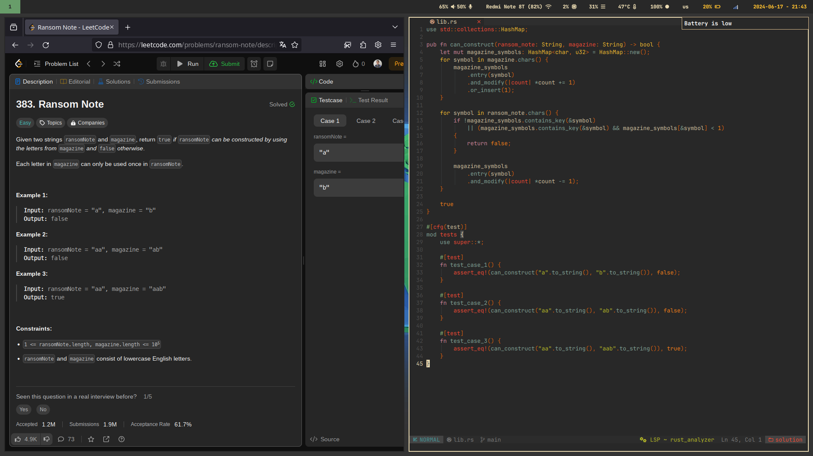

# Gruvbox theme for sway windows manager

<table>
  <tr>
    <td colspan="2"></td>
  </tr>
  <tr>
    <td></td>
    <td></td>
  </tr>
  <tr>
    <td></td>
    <td></td>
  </tr>
</table>

## Quick start

- Copy all folders (except `mc` and `nvim`) to `~/.config`.

- Setup skin for midnight commander:
  
  ```
  mkdir -p ~/.local/share/mc
  cp mc ~/.local/share
  ```

- Clone NvChad config for neovim:
  
  ```
  git clone https://github.com/NvChad/starter ~/.config/nvim && nvim
  ```

- Enable battery notifier service:
  
  ```
  systemctl --user enable ~/.config/systemd/user/battery-notifier.service --now
  ```

- If necessary edit `.bash_profile`.

- Copy `.tmux.conf` to user's root directory.

## License

MIT

## Author

[Kuat Kurpenov](https://github.com/kurpenok "Kuat Kurpenov") (Telegram/VK: @kurpenok)
